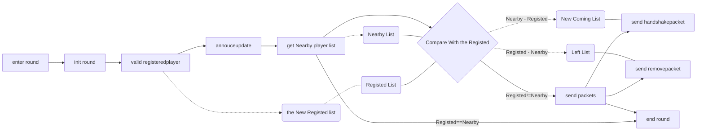

# Day 3 基于BossEvent包的minecraft-BedrockServer自定义阶段场景实现
## **背景前言**
minecraft-BedrockServer是游戏我的世界基岩版版本的一款测试服务端软件，BossEvent数据包是游戏中劫掠或者带有boss标签的实体使用的交互数据包，在vanilla游戏中通过这个数据包来告诉玩家Boss名称和血量或者劫掠事件当前的状态。
## **目的**
在游戏中，劫掠可以显示和监听剩余掠夺者的数量，告诉我们当前劫掠的进度，我们希望可以利用这个数据包，实现类似劫掠或者自定义度更高的阶段化场景功能.
## **准备工作**
由于缺乏相应的api，我们首先需要对vanilla游戏的劫掠的收发包工作进行监听，为后面模仿实现功能提供数据支撑，这里我们选择用导出API进行监听。
我们首先对劫掠刚刚触发时的相关数据包进行监听： <br>
<br>
不难看出劫掠中会首先广播一个StartShow的BossEvent包给客户端，同时更新村庄钟的状态表示已进入劫掠，客户端收到BossEvent包会向服务端发送一个请求包请求注册玩家到当前的劫掠事件中（注意bossUniqueID和Maybe_PlayerUniqueID是一样的)，随后服务端会会处理注册；然后向已注册事件的玩家发送Title和HealthPercentage来更新目前劫掠的标题和加载百分比，这个过程是一直持续的，作为告知玩家当前劫掠进度的方式，我们称其为状态更新机制，频率是每tick一次<br>
<br>
当玩家离开劫掠区域时，服务端会主动发送玩家Hide类型的BossEvent包，玩家收到后会发送UnRegisterPlayer的回执给服务端，至此玩家就从劫掠事件中移除了。<br>
劫掠事件中也会监听相关实体变化从而更新劫掠状态，例如最后两个实体时发送的劫掠血量和标题名称会改变，这是之前说明的状态更新机制实现的 <br>
当玩家完成一波劫掠时，名称和标题都会发生更改，同时会更新村庄钟的状态： <br>
 <br>
但劫掠胜利或失败时（这里选取失败） ：<br>
<br>
失败和胜利时，状态更新机制告知了玩家，但是劫掠事件并没有立即结束，而是选择继续广播数据，并在一段事件后注销劫掠事件：<br>
<br>
## **启示和反思**
其实不难发现在这个过程中bedrockserver存在很多迷惑操作，首先是状态更新机制，为什么在数据不变时要持续向客户端通知标题和进度百分比？这样是否额外浪费了资源？其次在事件结束时，状态更新机制仍在运作，但是后续标题和百分比并不会发生变化，理论上没必要进行状态更新告知；如果是担心新进入或者突然退出的玩家无法及时获取最新状态，只需在进入或退出的时候发生更新状态的包就行了，对于离开的玩家直接Hide就可以。
## **设计思路**
那么我们需要首先设计一个劫掠事件需要的变量，我们需要有当前劫掠的回合数，最大回合数，以及劫掠事件的中心点坐标和维度和判定进入劫掠的范围，然后我们需要一个记录当前处于劫掠事件中的玩家名单，用于之后广播状态更新，这个名单会在每次事件判定进入劫掠范围的玩家数量时更新，应该如何处理新进入玩家和新退出玩家呢？在劫掠事件进行tick（单位处理时间刻度）时，利用BDS的api获取一个当前在劫掠范围里的玩家名单，然后和之前的保存的注册的玩家名单比较得出新进入玩家序列和退出玩家序列。

```C++
        BlockPos centerpos;
        int dimid;
        AABB area;
        int round = 0;
        int roundmax;
        std::vector<ActorUniqueID> RegistereddPlayerlist;
```
tick执行流程大致可描述如下，注意实际发包时需要再次判断玩家是否在线


## **项目实现**

项目已开源，具体可见:
https://github.com/kkj9333/RaidBoss

# Day 4 元宇宙安全调研与探讨
## **前言**
这个是导师布置的小任务，是不是感觉很空泛哈哈哈...
## **元宇宙定义**
– 元宇宙技术即指虚拟世界,现有的有vr/ar/xr技术,涉及的范围有云计算,物联网,5g,wifi技术等。
很快，互联网上连接的将不是电脑而是大脑。接下来顺理成章的是，人的记忆、意识和全部人格将能够上载到计算机和网络中，人类有可能生活在虚拟世界中
## **元宇宙安全**
元宇宙要创造的是一个新世界，一个人机物三元融合的新世界。元宇宙基本符合新一代信息技术的演进规律和发展趋势。
<br>
元宇宙安全面临挑战<br>

- 网络攻击

- 基础设备，物联网终端设备安全

- 身份管理与信任管理

- “元宇宙”法律纠纷

- 数据隐私安全

