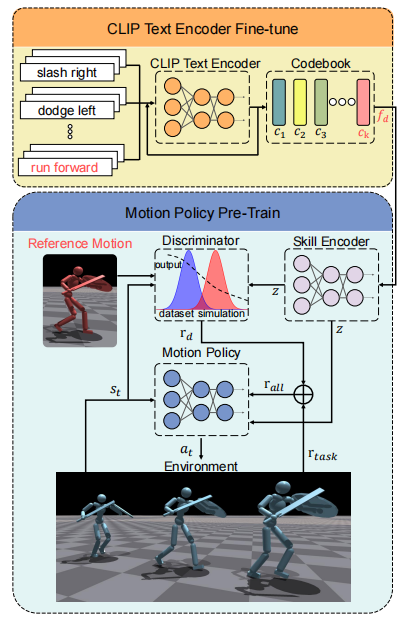
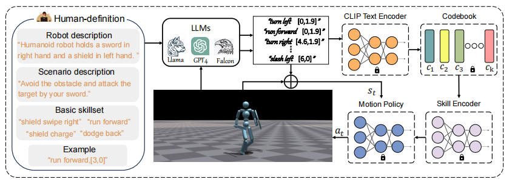
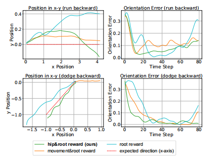

## week39
嘿！我又回来了没想到转瞬间已经是第39周了，从5月到8月，我经历了一段短暂而悲伤的感情，我不想再沉浸于悲伤之中了，我想走出来，就从继续做这个计划开始吧！

### Day17 Prompt, Plan, Perform: LLM-based Humanoid Control via Quantized Imitation Learning

作者在这篇文章中尝试将模拟学习获得的技能和LLM的规划能力结合起来，以完成更为复杂的任务。
三个组合：一种基于语言的自适应技能运动策略，一种基于clip的自适应语言离散编码器和LLM规划器。

 
在这个方案里，模拟学习用一个条件鉴别器匹配潜在动作，鉴别器输出由策略生成的状态转换与数据集之间的相似度;CLIP-based 编码器将自然语言命令（caption）编码成一个512维的向量，对CLIP文本编码器进行微调和文本特性的向量量化，允许代理处理看不见的字幕，并减少了训练过程的内存；一个LLM规划器，利用提示词提取行动规划知识。
 

#### 实验
我们评估了三种不同的奖励结构对控制机器人方向的效果。第一个奖励结构只关注机器人的根的方向，第二个奖励结构只强调机器人的根的方向，第三个包含了机器人的根和两个臀部的方向。我们沿着x轴设置了机器人所期望的方向。 
实验结果验证实了我们提出的框架通过引入基于编本的向量量化（codebook-based vector quantization），有效地解决了复杂的任务，并适应了llm的不确定的语义输出。 
 
#### 结论
作者提出了一个新框架，结合了一个单一的对抗性模仿学习策略和llm，通过调度技能来执行复杂的任务。此外，还设计了一般的奖励，以确保一个单一的控制策略能够解决大多数的需求。
