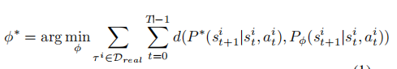
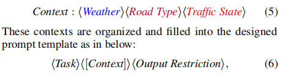
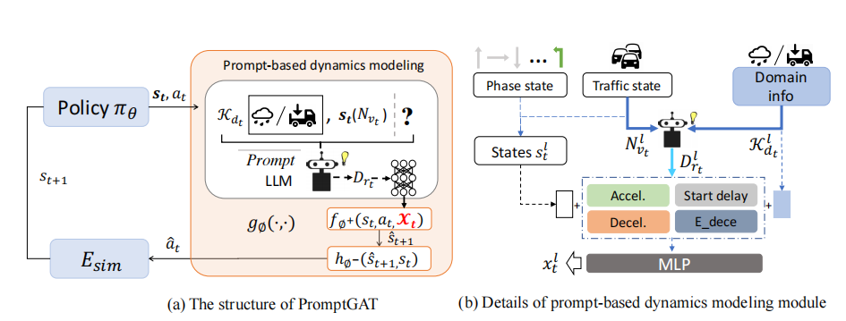
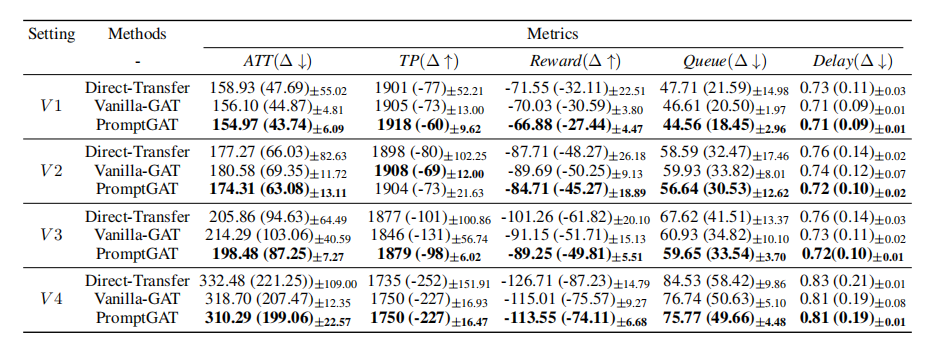
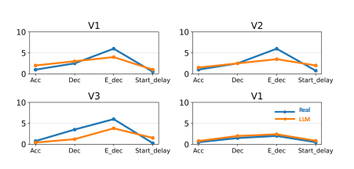
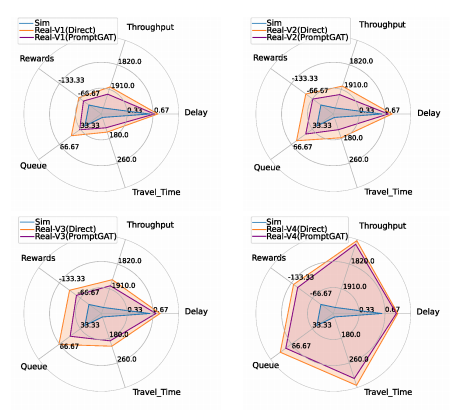
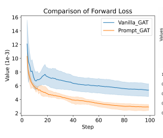

# Day18 【综述练笔】大模型与强化学习综述
 随着大语言模型（LLM）的迅猛发展，大模型在各行各业的应用越来越广泛，并且取得了不少成就。大模型的特点在于其蕴含丰富的知识库，具有很强的通用性，在某些领域可以达到比拟人类甚至超过人类的水平。在强化学习领域运用LLM是个不错的idea，结合目前LLM存在的上下文长度约束、上下文内学习和泛化能力等问题，可以有很多研究方向。

##  LLM 加速&优化RL学习

### LLM Powered Sim-to-real Transfer for Traffic Signal Control

这篇论文是解决强化学习模拟与现实环境中性能差距问题的一个示范。论文旨在解决交通信号控制中从仿真到真实环境的迁移问题。作者首先将交通信号控制问题建模为强化学习问题，然后提出一种名为PromptGAT的方法，将LLM引入到基于实际动力学的行动转换（GAT）框架中，以利用人类知识并增强对真实动力学的理解。

#### 个人的一点意见
这个应用方向和思路是没问题的，但是研究方向本身不存在意义，因为交通管控目前已经有很多成熟方案，对于极端情况下造成的拥堵单靠监督管控很难有实质上的进展，这个已经不是模拟和现实之间差距的问题了。交通本身追求就不是争分夺秒，而是安全第一，人已经是不可控因素，再来个不稳定TSC，何必呢？而且这篇论文利用LLM竟然估计四个指标（平均加速、平均减速、平均紧急减速、平均延误）。
这种更加需要真实路况的东西，我觉得由LLM来估计是不可靠的（在本文中，实际上LLM的知识也是被用于模拟数据集的构建和状态模拟）。

#### Sim-to-real Transfer的一些相关研究
 分为三类：
- 领域随机化（Tobin 2019; Andrychowicz et al. 2020）
- 领域自适应（Tzeng et al. 2019; Han et al. 2019） 致力于原域与目标域之间对齐特征来解决跨域分布问题
- grounding methods  通过校正模拟器的偏差，提高了模拟器对真实世界的精度。

#### 论文内容
 
- **GAT（Grounded Action Transformation）**

GAT背后的关键思想是诱导模拟器动态与真实世界相似，其中策略学习在模拟中发生，而动态学习依赖于真实世界的数据，旨在通过利用真实世界的真实轨迹来适应和修改模拟环境的Esim来增强机器人的学习，从而达到缩小差距的效果。
 GAT的损失函数如下： 

 Pϕ代表模拟过渡动力学，P∗代表真实世界的过渡动力学
 d(·)表示动力学差距 
有一个前向模型和一个逆模型，通过一组<st,at>来分别得到策略预测的at，和逆模型预测的at^，这样Esim就可以驱使Esim里的st+1趋近前向模型预测的s^t+1（前向模型使用真实世界数据集训练，目的是预测下一个状态），使得状态分布接近真实世界的，从而使Pϕ趋向P*。
 
 
传统的GAT方法的一个局限性是它们难以处理现实世界中未被观察到的状态。

- **PromptGAT**
  
这个GAT集成了基于提示的动态建模模块（dynamics modeling module）。通过结合人类知识和llm来缓解交通信号控制中的模拟-实传输问题。

#### PromptGAT的总体框架
- (a)PromptGAT的结构，采用基于提示0的提示动态建模，将llm的知识集成到正向模型fϕ+的学习中。
- (b)基于提示的动态建模模块（ dynamics modeling module）的细节，该模块推断和集成动态变化与交通状态的变化
 

#### 实验结果
四种不同路况数据集测试很好

LLM的模拟路况接近事实

 PromptGAT相比Direct的现实测试更稳定

训练正向预测模型相比原版GAT更快收敛，且损失更低

#### 结论
本文使用LLM来构建模拟环境的路况，并使用基于提示的动态建模来解决Sim-to-real Transfer问题，以提高模拟器对真实世界的精度。
尽管个人认为落地的研究意义不大，但是这个LLM的利用角度是有比较新颖的。

