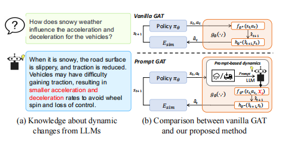

# Day18 【综述练笔】大模型与强化学习综述
 随着大语言模型（LLM）的迅猛发展，大模型在各行各业的应用越来越广泛，并且取得了不少成就。大模型的特点在于其蕴含丰富的知识库，具有很强的通用性，在某些领域可以达到比拟人类甚至超过人类的水平。在强化学习领域运用LLM是个不错的idea，结合目前LLM存在的上下文长度约束、上下文内学习和泛化能力等问题，可以有很多研究方向。

##  LLM 加速&优化RL学习

### LLM Powered Sim-to-real Transfer for Traffic Signal Control

这篇论文是解决强化学习模拟与现实环境中性能差距问题的一个示范。论文旨在解决交通信号控制中从仿真到真实环境的迁移问题。作者首先将交通信号控制问题建模为强化学习问题，然后提出一种名为PromptGAT的方法，将LLM引入到基于实际动力学的行动转换（GAT）框架中，以利用人类知识并增强对真实动力学的理解。

 
- **GAT（Grounded Action Transformation）**

GAT背后的关键思想是诱导模拟器动态与真实世界相似，其中策略学习在模拟中发生，而动态学习依赖于真实世界的数据，从而达到缩小差距的效果。

它将当前状态st和动作作为输入，并预测现实世界中可能的下一个状态st+1。

- **PromptGAT**
  
这个GAT集成了基于提示的动态建模模块（dynamics modeling module）。