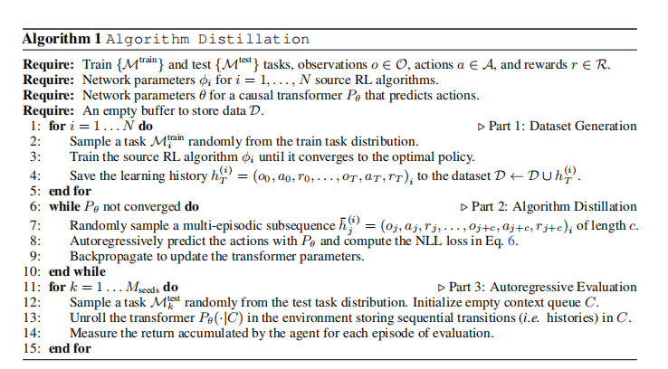
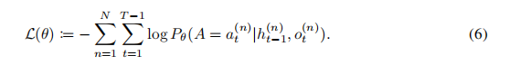

# D

## IN-CONTEXT REINFORCEMENT LEARNING WITH ALGORITHM DISTILLATION
一篇用RL历史学习记录来训练transformer的算法蒸馏的论文 

这个是不是可以训练强化学习大模型，针对不同任务，训练不同强化学习算法，这样就可以存储历史学习记录 

貌似是上下文强化学习（Contextual Reinforcement Learning）的。其是强化学习的一种变体，它强调在不同环境或上下文下学习和适应的能力。
### 结论
我们已经证明了算法蒸馏可以通过使用因果转换器建模RL的学习历史，将权重内的RL算法（基于权重的多任务强化学习？）提炼为上下文内的RL算法，并且AD可以学习比生成源数据（GAN）的算法更有数据效率的算法。

### 缺点
大多数RL场景都有较长的多情景环境，
Transformer会限制序列长度而受到限制。