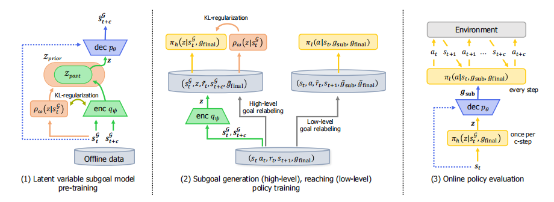
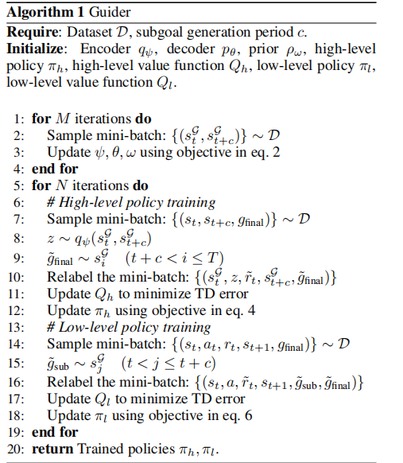

# 强化学习论文研读

## Guide to Control: Offine Hierarchical Reinforcement Learning Using Subgoal Generation for Long-Horizon and Sparse-Reward Tasks
### 简介
使用子目标生成来解决长时任务和稀疏奖励任务，高级策略依次生成一个子目标，可以引导agent达到重要目标，而低级策略学习如何达到每个给定的引导子目标。是一种离线HRL算法。
### code link
https://github.com/gckor/Guider 
### 关键解决问题
如何生成和评判高质量生成子目标：通过预训练一个潜在的子目标先验模型，高质量的子目标生成是可能。子目标应该更短，更简单更容易。
 
如何使低级策略学习到如何达到每个子目标：（是否可以考虑DT，强化学习大模型，针对大目标化解成已可解决的子目标来达成这个）。
### 关键技术路线
预训练权重模型来进行正则化，预训练编解码器来生成预测状态，利用其标注离线数据集来训练生成容易实现的子目标并用权重模型正则化的高级策略，以及一个常规的达成子目标的低价策略（任何基础RL模型）。

### 总体框架

对潜在变量模型进行了预先训练，将可达的子目标嵌入到潜在空间中。一个高级策略被训练来生成一个低级策略可容易到达的子目标，同时使用一个预先训练过的先验模型进行正则化。低级策略学习达到生成的子目标。在在线评估中，高层策略每一个步骤生成一个子目标来指导低级策略。
可以理解为高级策略用于每c步生成潜在目标空间的子目标z，低级策略则交互学习以达到被解码成为的子目标。
#### 训练部分（组成部分）
通过无监督学习预训练潜在变量模型嵌入可达到的子目标在潜在空间。 
模型由一个基于t时刻状态和t+c时刻状态生成z的编码器，一个基于t时刻状态和z生成t+c时刻状态的解码器和一个可训练的基于t时刻状态生成z的权重模型组成。

 - (1)通过无监督学习预训练的潜在变量模型。
 - (2)潜在变量模型标注数据集来训练高级政策生成一个子目标并使用权重模型正则化，逐步接近一个给定的final目标。
 - (3)训练的低级策略达到高层生成的子目标。

### 算法概览

### 结论
在这项工作中，我们提出了Guider，一种分级强化学习方法，学习在高水平生成子目标，并在低层次达到生成的子目标。我们对潜在空间中的子目标先验分布的无监督预训练可以有效地规范子目标生成策略。通过简单的低级策略，可以很容易地实现生成的子目标。实证研究表明，我们提出的方法在长范围和稀疏奖励任务上优于先前的非RL方法。未来工作的一个有趣方向是从高维空间生成有意义的子目标，如有RGB图像。我们还计划设计一个灵活的子目标生成模型，其中生成周期可以根据情况而变化。

## HIQL: Offline Goal-Conditioned RL with Latent States as Actions
### 简介
一种基于离线数据的目标条件（Goal-Conditione）分层RL算法，使用了一个无行动的价值函数，然后学习了两种允许我们利用这个结构的策略：一种是将状态视为行动并预测一个子目标的（潜在表示）的高级策略，另一种是预测实现这个子目标的行动的低级策略。
### code link
https://seohong.me/projects/hiql/

### 算法概览

## Words into Action: Learning Diverse Humanoid Robot Behaviors using Language Guided Iterative Motion Refinement
### 简介
这是一篇将LLM动机的文本输入转换为机器行为的有关研究，其实这里想到的就是我一直认为LLM训练RL的最大优势。首先学习一个神经网络策略，该策略通过结合大型语言模型（LLM）、运动重定位和运动模仿，给定自然语言命令生成行为。在合成运动的基础上，再通过更新文本提示符和查询LLM来进行迭代微调，以找到与训练历史上最近的运动相关联的最佳checkpoint。

####  VQ-VAE 
训练其以表示人类运动的潜在表示空间，(注意这是一种变分编码器，潜在表示空间通常是通过编码器实现的)，解码生成的部分实际上是使预测器输出的潜在变量Z最大可能接近一个代码本中的代码C（我的理解是是为了生成运动序列的，参考 T2M-GPT中基于数据集HumanML3D训练transformer的实现）
####  Motion retargeting from human to robot
上一步已经生成的人类运动轨迹，对于机器人来说可能会有差距（由于身体结构等），于是希望使用学习的控制策略来模拟它，注意这里强调的是目标或者说动机上的模拟或者重定向。
#### Training control policy to imitate retargeted motion
给定机器人的一个参考轨迹，我们想要训练一个控制策略来可动态的模拟。应该注意的是，其中一些状态在机器人的物理上可能不现实。我们希望我们的方法能够忽略这些状态，而专注于轨迹4中可以可靠跟踪的部分。运动模仿方法为这一问题提供了一个很有前途的解决方案。

### LLM作用
- 创建/更新提供给T2M-GPT的指令，以合并更新
- 使用之前训练过的最接近的模型（如果适用）初始化策略，以提高样本效率。

### 个人的一些小见解
其实LLM在这种任务中一个最大的作用就是把观察描述变为规划或者解决方案描述，它相当于代替了人在原本方案中的作用，转而使用LLM来代替。所以需要思考的是原本RL中哪些是需要人为进行调参或者操作的，这一部分是否可以被LLM取代，达成的效果除了可解释性更强以外，是否比人为更好（比如速度变快，效率提高，稳定性更好等）。或者有某部分工作是非人做的，但是人做一定会更好，现在我用LLM去做，这样也是会比非人传统方案有提升的。